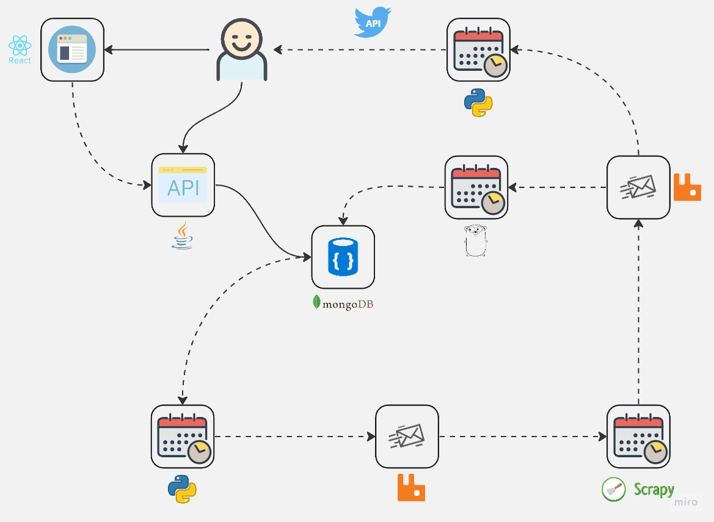

## Projeto Sport News


[](https://github.com/antonio-dias/sport-news/blob/main/README.md)

Este projeto será desenvolvido para estudar Python, Kafka, MongoDB e outras tecnologias.

<hr>

### Mapa do Projeto



### Como executar os projetos com docker:

``````
$ docker-compose up
``````